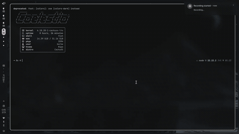

# BioSaka

**The worm meets bare metal.**

<p align="center">
  
  <br>
  <em>307/379 neurons, ~2800/3159 synapses. herm or male. all in your terminal.</em>
</p>

## what

BioSaka loads the actual C. elegans connectome from White et al. 1986 and Cook et al. 2019 — **both sexes**. Run the hermaphrodite (307 neurons, 2847 edges) or the male (379 neurons, 3159 edges) with a CLI flag. Leaky integrate-and-fire neural simulation, drawn in your terminal. Watch neurons spike in real time. Watch the worm crawl. Watch the brain light up.

no GUI. no bloat. just a worm in a box.

no windows support either. this worm doesnt do microslop. tested on arch linux. works on macos and other linux distros if youre not a coward.

## quick start

### arch linux (AUR)

```bash
yay -S biosaka
biosaka worm
```

### cargo install

```bash
cargo install biosaka
biosaka worm
```

### from source

```bash
git clone https://github.com/berkeoruc/biosaka
cd biosaka
cargo run --release
```

needs a terminal that likes crossterm. if your terminal cant handle escape codes, get a better terminal.

## controls

| key | what it does |
|---|---|---|
| `1` `2` `3` | graph / worm / stats |
| `c` | credits |
| `i` | technical info (scroll with up/down) |
| `space` | pause / resume |
| `+` / `-` | zoom in / out (graph tab) |
| arrows | pan (graph tab) or scroll (info tab) |
| `q` | quit |

## CLI

```
biosaka [--sex <hermaphrodite|male>]
```

- `--sex male` / `-s m` — load the male connectome (379n, 3159e)
- `--sex hermaphrodite` / `-s h` — load the hermaphrodite connectome (307n, 2847e) [default]
- `--help` — detailed help
- `--version` — version info

## features

- **dual-sex connectome** — hermaphrodite (307n, 2847e) or male (379n, 3159e) via `--sex male`
- **real data** — both sexes from published EM reconstructions (White 1986, Cook 2019)
- **spiking simulation** — LIF neurons with synaptic transmission and gap junction coupling
- **5-tab TUI** — neural graph, worm view, statistics, credits, technical info
- **live graph** — circular/force-directed layout, color coded by activity, male-specific neuron highlighting
- **worm body** — 20-segment body with sinusoidal movement driven by motor neurons, tail fan (male) or vulva (herm) visuals
- **real-time stats** — network activity, spike counts, per-neuron firing rates, sex comparison
- **interactive** — pause, zoom, pan, switch views. no mouse required.

## how it works

```
                         ┌──────────────────────┐
  data/connectome.csv ──>│   build.rs + build/  │──> static edge lists
    (White 1986)         │  (compile time)      │    herm: 307n / 2847e
    (Cook 2019)          │                      │    male: 379n / 3159e
                         └──────────────────────┘
                                    │
                          ┌─────────▼───────────┐
                          │  LIF neural engine  │
                          │  (simulation loop)  │
                          └──────────┬──────────┘
                                    │
                    ┌───────────────┼───────────────┐
                    ▼               ▼               ▼
             ┌──────────┐   ┌──────────┐   ┌──────────────┐
             │  neuron  │   │  worm    │   │    TUI       │
             │  model   │   │  body    │   │  (ratatui)   │
             └──────────┘   └──────────┘   └──────────────┘
```

neurons are leaky integrate-and-fire units. heres the math without getting boring:

```
V(t+1) = V(t) x 0.95 + I_syn + noise
```

- membrane potential leaks 5% every tick
- chemical synapse: pre fires -> post gets a jolt
- gap junctions: direct electrical coupling between neurons
- gaussian noise keeps things from being boring

the worm body is 20 segments. motor neurons (VB, DB, VA, DA) drive a sinusoidal wave. left-right asymmetry makes it turn. no two runs look the same.

## data sources

- White, J.G. et al. (1986). *The Structure of the Nervous System of the Nematode Caenorhabditis elegans.* Phil. Trans. R. Soc. Lond. B
- Cook, S.J. et al. (2019). *Whole-animal connectomes of both Caenorhabditis elegans sexes.* Nature 571, 63-71
- OpenWorm project — [c302](https://github.com/openworm/c302)

## docs

- `logo.txt` — ASCII art. opens the worm's DNA with a text editor.
- `LICENSE` — research use only. dont sell the worm.
- [aur/biosaka](aur/PKGBUILD) — arch linux package.
- `src/` — 6 modules + `build/`. all handwritten.

## license

**BioSaka Research License** — All rights reserved.

This project is a learning and research project. You may use,
modify, and study the code for **non-commercial research and
educational purposes only**. Commercial use, redistribution,
and incorporation into commercial products are prohibited.

See [LICENSE](LICENSE) for full terms.

---

*handwritten. berke oruc, 2026.*
